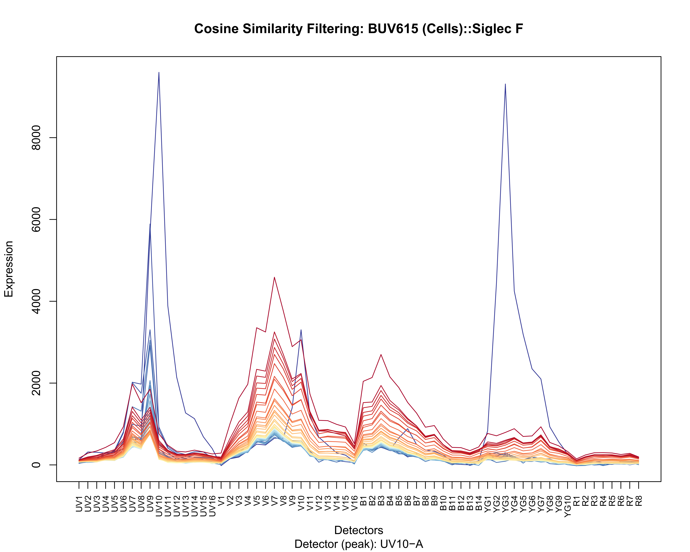
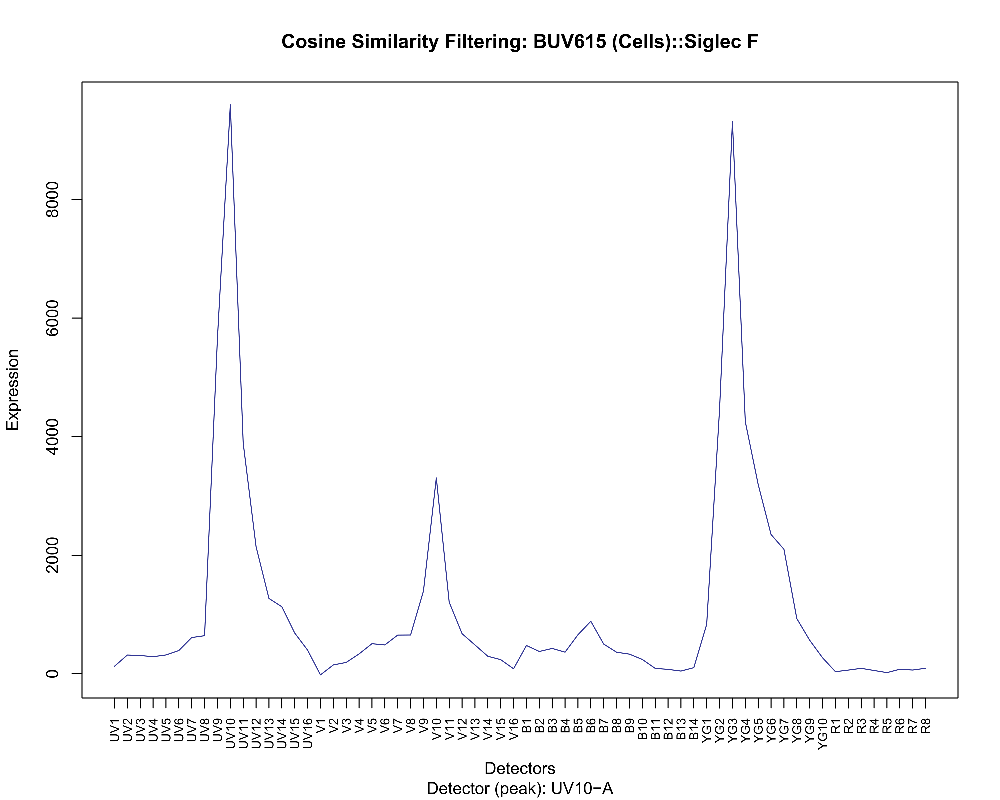
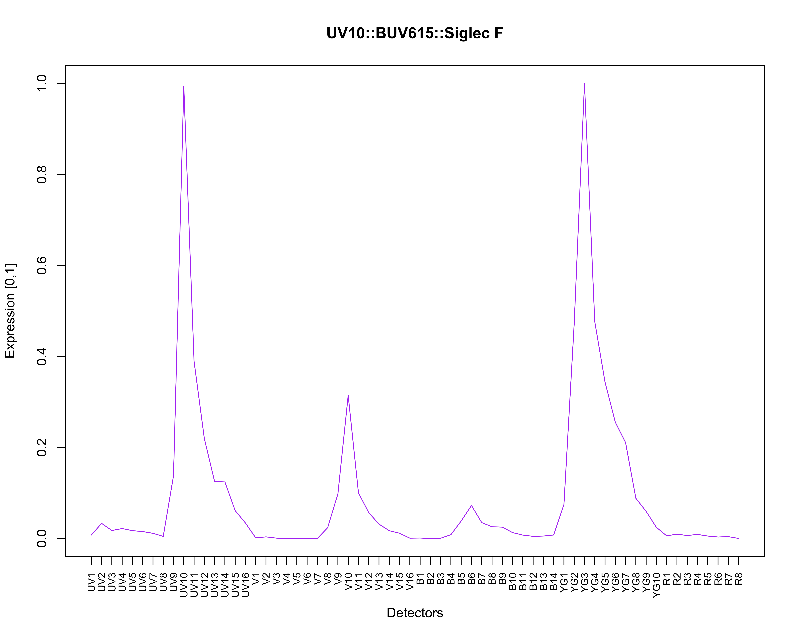

<!-- README.md is generated from README.Rmd. Please edit that file -->

# spectracle

<!-- badges: start -->

<!-- badges: end -->

## Installation

You can install `spectracle` from [GitHub](https://github.com/) with:

``` r
pak::pak("nlaniewski/spectracle")
```

## Making a Spectacle of Your Spectra

The series of figures below is a visual representation of what can be
accomplished when using `spectracle` – a FULLY AUTOMATED method for
processing single-color full spectrum cytometry controls.

``` r
## simply locate a directory containing raw reference controls
raw.reference.controls <- list.dirs(path = ".")
## execute the function
spectra <- spectracle(raw.reference.controls)
```

The source data used to generate these figures is a single-stained
reference control (mouse spleen) – `BUV615::Siglec F`; in the primary
data (not shown), the rare, truly positive events (which number less
than ~100) are obscured and/or directly impacted by primary (V7) and
secondary (UV7) autofluorescence (AF).

### Rare Spectral Signature Among Dominant AF `[Figure 1]`

<figure>

<figcaption aria-hidden="true">UV10::BUV615::Siglec F – a single
‘spectral trace’ (blue) obscured by autofluorescence (red)</figcaption>
</figure>

### AF Removal to Isolate ‘Spectral Events’ `[Figure 2]`

In a completely data-driven fashion, the intrusive/nuisance AF is
identified, characterized, and then removed from the single-color
control to identify/reveal top expressing ‘spectral events’.

<figure>

<figcaption aria-hidden="true">UV10::BUV615::Siglec F – a single
‘spectral trace’ (blue) isolated after autofluorescence
removal</figcaption>
</figure>

### Per-cell Matching / Normalized Spectra `[Figure 3]`

The ‘spectral events’ are scatter-matched using nearest-neighbors to a
representative unstained control on a per-cell basis, allowing for
accurate AF/background subtraction that is invariant to population
spread and/or frequency. The result is well-characterized, normalized
spectra that can then be used to unmix raw data.

<figure>

<figcaption aria-hidden="true">UV10::BUV615::Siglec F – normalized (0,1)
spectra</figcaption>
</figure>
