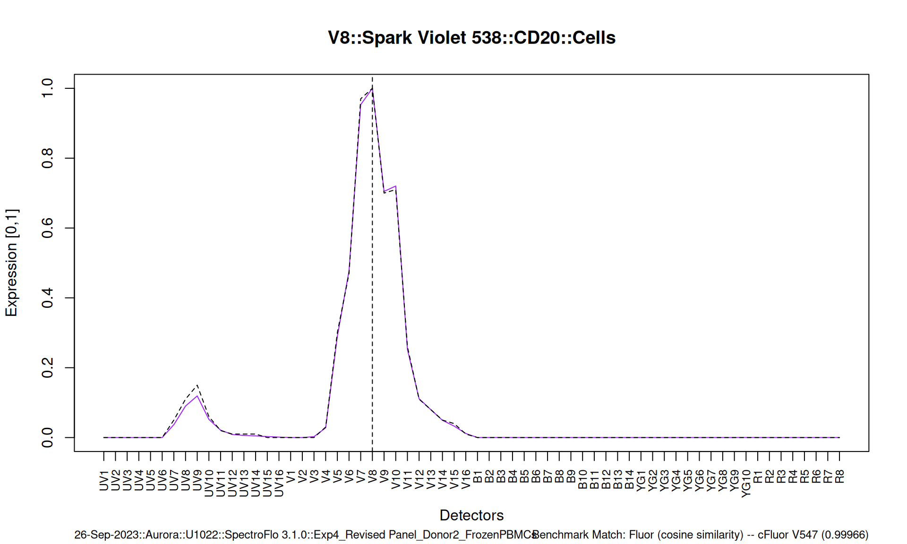
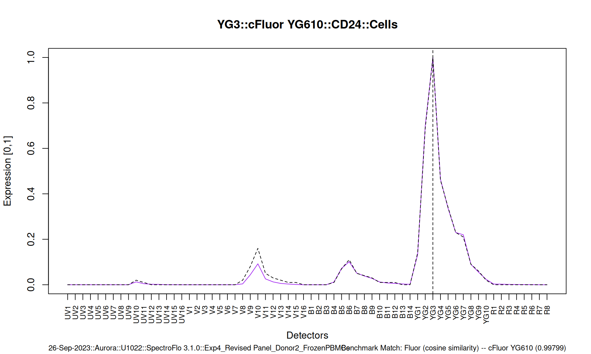
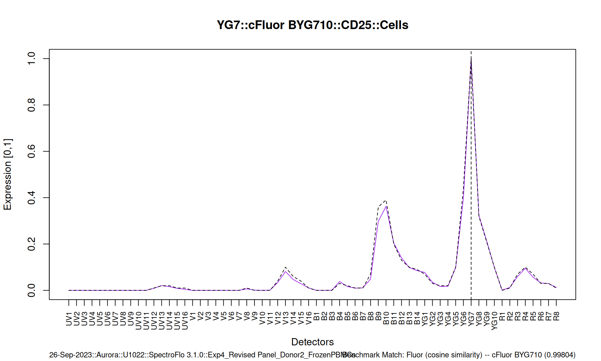
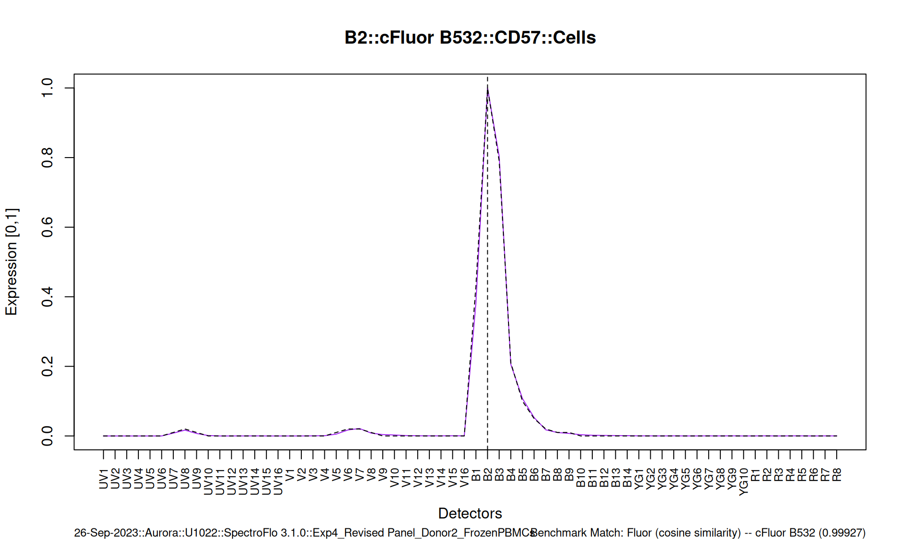
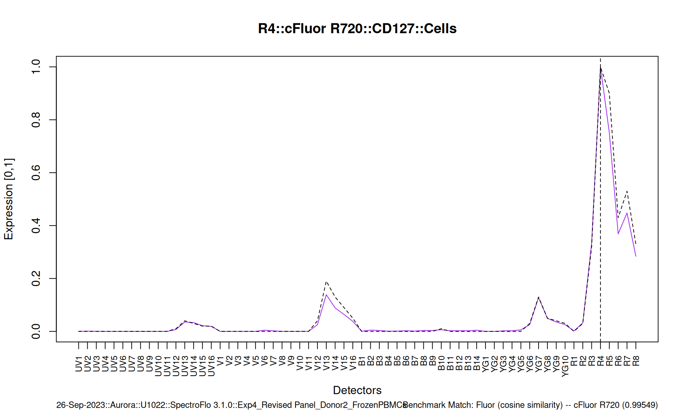
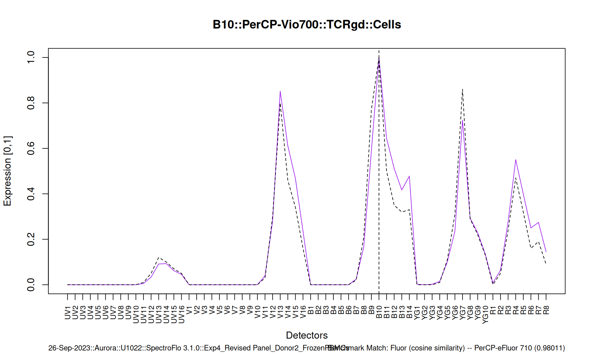
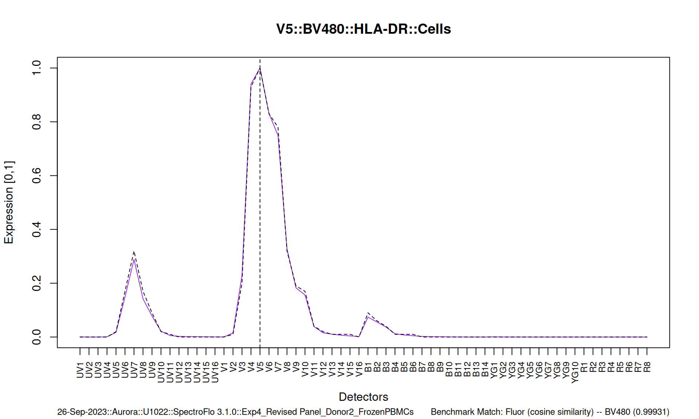
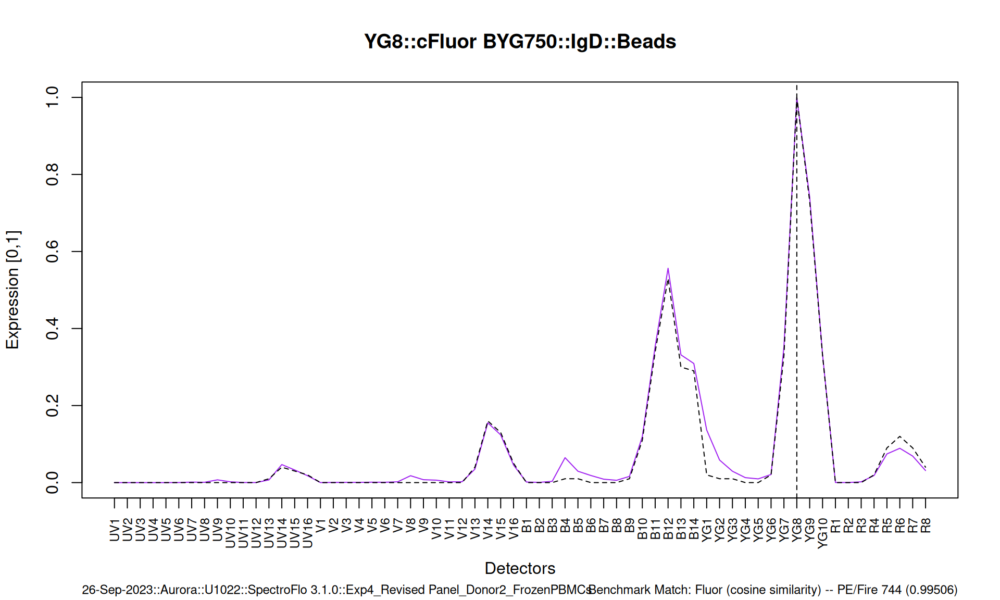

# spectracle – OMIP-069v2

``` r

library(spectracle)
```

## Objective

Derive spectra using OMIP-069v2 source data – both ‘Beads’ and ‘Cells’

## Source Data

Source data as presented in
[OMIP-069v2](https://pubmed.ncbi.nlm.nih.gov/39268753/) is downloaded
from its [public
repository](https://doi.org/10.6084/m9.figshare.25901635.v1):

- [figshare –
  OMIP-069v2](https://figshare.com/articles/preprint/40-color_commentary/25901635/1?file=46539949)

Click to see how OMIP-069v2 source data was obtained.

``` r

## manually download or follow this script

## source directory; this path is user-dependent;
## the author of this article previously downloaded these source files to:
dir.source <- "W:/OMIP-069v2_flowstate/data_source/Exp4_Revised Panel_Donor2_FrozenPBMCs/"
## these source files were processed using spectracle();
## the results were saved to an .RDS solely for building this article

## BELOW IS THE METHOD USED TO DOWNLOAD/VERIFY SOURCE

## figshare name: Exp4_Revised Panel_Donor2_FrozenPBMCs
## Experiment ($PROJ) name: Exp4_Revised Panel_Donor2_FrozenPBMCs
## Size: 1.26 GB
## MD5 checksum: 6c8ee84405088647ff770cf7c6fd8143
## download link: https://ndownloader.figshare.com/files/46539949
## Citation: Bonilla, Diana Lucia (2024). 40-color commentary. 
## figshare. Preprint. https://doi.org/10.6084/m9.figshare.25901635.v1

## test for existence and integrity of source files (.fcs)
if(dir.exists(dir.source)){
  digests <- sapply(list.files(dir.source, full.names = T, recursive = T, pattern = ".fcs"),
                    digest::digest,
                    file = TRUE)
  digest <- digest::digest(as.vector(digests))
  if(digest != "06d61a305a32085d4dd35a1bba0b03a3"){
    message("Digest of source files (.fcs) does not match historic value;\ndownloading source files...")
    download.source <- TRUE
  }else{
    download.source <- FALSE
  }
}else{
  download.source <- TRUE
}
if(download.source){
  temp <- tempfile(tmpdir = "data_temp/", fileext = ".zip")
  zip.link <- "https://ndownloader.figshare.com/files/46539949"
  curl::curl_download(
    url = zip.link,
    destfile = temp,
    quiet = FALSE,
    mode = "wb"
  )
  ## check the hash
  if (tools::md5sum(temp) != "6c8ee84405088647ff770cf7c6fd8143") {
    stop("MD5 checksum (hash) of the downloaded .zip does not match the historic value.")
  }
  ## files contained in the .zip: 169 files;
  ## Raw, Unmixed, and SpectroFlo software files (.Expt, .WTML, and .UST)
  utils::unzip(temp, list = TRUE)
  ## unzip to "./data_temp"
  utils::unzip(temp, files = NULL, exdir = "./data_temp/")
  ## get the original 'Project' ('$PROJ') name to reconstruct directory structure
  proj <- list.files("data_temp/", full.names = T, recursive = T) |>
    grep("Raw.*Unstained", x = _, value = T) |>
    flowstate:::readFCStext() |>
    flowstate:::keywords.to.data.table() |>
    _[][['$PROJ']]
  ## R scripts directory
  dir.analysis <- file.path("R", proj)
  if (!dir.exists(dir.analysis))
    dir.create(dir.analysis)
  ## create the source directory
  dir.out <- file.path("data_source/", proj)
  if (!dir.exists(dir.out))
    dir.create(dir.out)
  ## move the source .fcs files; Raw and Unmixed
  fcs.to.move <- list.files(
    "data_temp/",
    full.names = T,
    pattern = ".fcs",
    recursive = T
  )
  dirnames <- dirname(fcs.to.move) |> unique()
  sapply(dirnames, function(i) {
    dir.out.sub <- sub("data_temp", dir.out, i)
    if (!dir.exists(dir.out.sub))
      dir.create(dir.out.sub, recursive = T)
  }) |> invisible()
  file.rename(from = fcs.to.move,
              to = sub("data_temp", dir.out, fcs.to.move)) |> invisible()
  ## move the SpectroFlo experiment files
  dir.out.expt <- file.path(dir.out, "SpectroFlo_experiment")
  if (!dir.exists(dir.out.expt))
    dir.create(dir.out.expt)
  files.to.move <- list.files("data_temp/", full.names = T, pattern = "Expt|UST|WTML")
  file.rename(from = files.to.move,
              to = sub("data_temp", dir.out.expt, files.to.move)) |> invisible()
  ## cleanup
  unlink(temp)
  unlink("data_temp/Raw/", recursive = T)
  unlink("data_temp/Unmixed//", recursive = T)
}
##
```

### Source Files – Raw Reference Controls (Cells)

‘./Raw/Reference Group’ file paths

``` r

dir.source.raw <- grep("Raw.*Ref", list.dirs(dir.source), value = T)
raw.reference.controls <- list.files(
  dir.source.raw,
  full.names = T,
  pattern = ".fcs"
)
```

## Derive Spectra

[`spectracle()`](https://nlaniewski.github.io/spectracle/reference/spectracle.md)
is fully automated and by design has limited function arguments; simply
pass the directory where the source files are contained.

``` r

spectra <- spectracle(dir.source.raw)
```

### Spectra – OMIP-069v2

[`spectracle()`](https://nlaniewski.github.io/spectracle/reference/spectracle.md)
returns a standardized
[`data.table::data.table()`](https://rdrr.io/pkg/data.table/man/data.table.html)
containing relevant metadata:

- deriving function
- date-of-acquisition
- cytometer, serial number, software
- sample identifier (sample name, fluor, marker/stain, peak detector,
  laser)
  - tissue.type: Beads ; Cells
- derived, normalized \[0,1\] spectra
- hash summaries for each spectra

``` r

spectra[]
```

### Spectra – Hashes

Derived using a fully data-driven/automated process, the resultant
spectra should reproduce given the same source data and function
version. A summary digest is generated from the individual hashes:

- Hash (md5) summary (historic): *dea437b3b39373c82a771ae5219c0300*

``` r

## hash (md5) summary for this instance
spectra[, digest::digest(hash.md5)]
#> [1] "dea437b3b39373c82a771ae5219c0300"
```

``` r

spectra[, .(N, S, detector, hash.md5)]
```

### Spectra – Namefix

As `spectra` is intended for use in unmixing raw data, the `N` and `S`
names will be used to form a conformant parameter name (`$PnN` and
`$PnS`); once derived and a `spectra` object is available in the
environment, these names can be edited.

``` r

spectra[
  i = sample.id == "LIVE DEAD Blue (Cells)",
  j = c('N', 'S') := list('LIVE DEAD Blue', 'Viability')
] |> invisible()
```

### Spectra – Traces

``` r

p <- plot_trace(spectra, plot.type = 'plotly')
```

#### AF (autofluorescence)

``` r

p$AF
```

#### UV

``` r

p$UV
```

#### V

``` r

p$V
```

#### B

``` r

p$B
```

#### YG

``` r

p$YG
```

#### R

``` r

p$R
```

#### Individual Traces – Benchmarked

A few choice individual traces (purple) – benchmarked against a
‘reference library’ (black).

##### V8::Spark Violet 538::CD20::Cells

``` r

plot_trace(
  spectra[N == "Spark Violet 538" & tissue.type == "Cells"], 
  benchmark = TRUE
)
```

[](https://nlaniewski.github.io/spectracle/articles/spectracle_OMIP-069v2_files/figure-html/plot-trace-1-1.png)

##### YG3::cFluor YG610::CD24

``` r

plot_trace(
  spectra[N == "cFluor YG610" & tissue.type == "Cells"], 
  benchmark = TRUE
)
```

[](https://nlaniewski.github.io/spectracle/articles/spectracle_OMIP-069v2_files/figure-html/plot-trace-2-1.png)

##### YG7::cFluor BYG710::CD25

``` r

plot_trace(
  spectra[N == "cFluor BYG710" & tissue.type == "Cells"], 
  benchmark = TRUE
)
```

[](https://nlaniewski.github.io/spectracle/articles/spectracle_OMIP-069v2_files/figure-html/plot-trace-3-1.png)

##### B2::cFluor B532::CD57

``` r

plot_trace(
  spectra[N == "cFluor B532" & tissue.type == "Cells"], 
  benchmark = TRUE
)
```

[](https://nlaniewski.github.io/spectracle/articles/spectracle_OMIP-069v2_files/figure-html/plot-trace-4-1.png)

##### R4::cFluor R720::CD127

``` r

plot_trace(
  spectra[N == "cFluor R720" & tissue.type == "Cells"], 
  benchmark = TRUE
)
```

[](https://nlaniewski.github.io/spectracle/articles/spectracle_OMIP-069v2_files/figure-html/plot-trace-5-1.png)

##### B10::PerCP-Vio700::TCRgd

``` r

plot_trace(
  spectra[N == "PerCP-Vio700" & tissue.type == "Cells"], 
  benchmark = TRUE
)
```

[](https://nlaniewski.github.io/spectracle/articles/spectracle_OMIP-069v2_files/figure-html/plot-trace-6-1.png)

##### V5::BV480::HLA-DR

``` r

plot_trace(
  spectra[N == "BV480" & tissue.type == "Cells"], 
  benchmark = TRUE
)
```

[](https://nlaniewski.github.io/spectracle/articles/spectracle_OMIP-069v2_files/figure-html/plot-trace-7-1.png)

##### YG8::cFluor BYG750::IgD

``` r

plot_trace(
  spectra[N == "cFluor BYG750" & tissue.type == "Beads"], 
  benchmark = TRUE
)
```

[](https://nlaniewski.github.io/spectracle/articles/spectracle_OMIP-069v2_files/figure-html/plot-trace-8-1.png)

### Spectra – Download

As `spectracle` will derive `spectra` for all files (provided that there
is a matched ‘universal’ unstained/negative), both ‘Beads’ and ‘Cells’
are included in the final `data.table`; when unmixing, `spectra` can be
subset to include only controls-of-choice.

Download OMIP-069v2 Spectra
